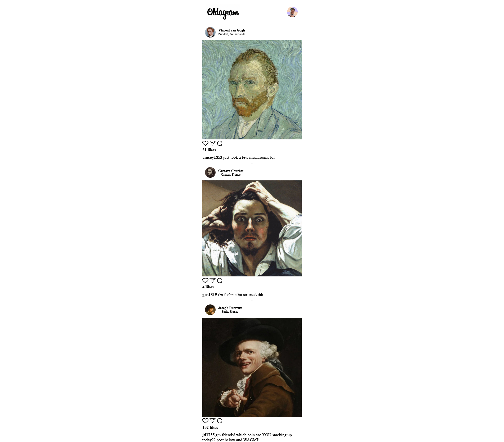

# Oldagram project solution

## Table of contents

- [Overview](#overview)
  - [The challenge](#the-challenge)
  - [Screenshot](#screenshot)
  - [Links](#links)
  - [Built with](#built-with)

## Overview

### The challenge

Users should be able to:

- View the optimal layout for the interface depending on their device's screen size
- View all cards.
- Clicking on heart icon should change background color and Increase Like count.

### Screenshot

### Links

- Solution URL: [https://github.com/MitaliShah/oldagram](https://github.com/MitaliShah/oldagram)
- Live Site URL: [https://mitalishah.github.io/oldagram/](https://mitalishah.github.io/oldagram/)

### Built with

- Semantic HTML5 markup
- CSS
- JavaScript

